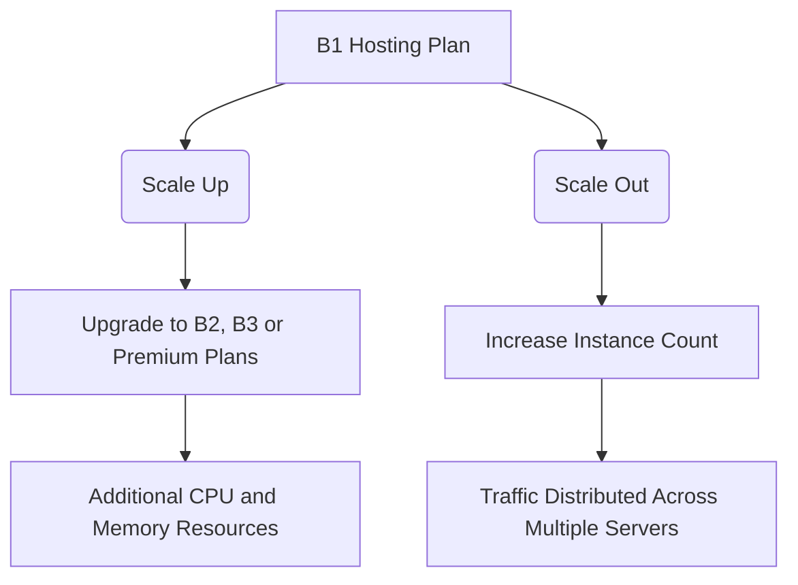

# Azure App Service Deployment for a Node.js Web Application

## Project Overview

This repository documents the deployment of a production-ready Node.js and Express application on Microsoft Azure App Service. The project demonstrates modern cloud deployment practices, including continuous integration and continuous delivery (CI/CD), secure configuration management, application monitoring, and scalability planning.

The solution highlights how Platform as a Service (PaaS) offerings can simplify application hosting while providing built-in tools for reliability, security, and operational visibility.

---

# Application Access

### Live Application Endpoint

The deployed application can be accessed through the Azure-hosted endpoint below:

```text
http://olamc-agg8fjdffgbbendg.westeurope-01.azurewebsites.net
```

---

# Repository Layout

The project is organized into logical components that separate application code, deployment workflows, and supporting documentation.

```text
azure-node-app/
├── .github/workflows/       # CI/CD pipeline definitions
├── public/                  # Front-end assets and styling resources
│   └── style.css
├── views/
│   ├── index.ejs            # Main application template
│   └── 404.ejs              # Custom error page
├── app.js                   # Application startup and routing logic
├── package.json             # Dependency and runtime configuration
├── summary.txt              # Project summary document
└── README.md                # Deployment and operational guide
```

---

# Solution Design Decisions

The infrastructure and platform choices were made to balance performance, cost efficiency, scalability, and ease of management.

## App Service Plan Selection

### Chosen Tier: Basic B1

The Basic B1 pricing tier was selected because it provides dedicated computing resources while remaining cost-effective for small to medium workloads.

### Benefits of the B1 Tier

* Dedicated virtual machine resources.
* Always On functionality to reduce startup delays.
* Support for SSL certificates and custom domains.
* Manual horizontal scaling capabilities.
* Integration with Azure monitoring services.

Compared to the Free tier, the Basic plan removes daily CPU restrictions and offers a more reliable hosting environment.

---

## Deployment Region

### Selected Azure Region: West Europe

The application was deployed in the West Europe region to provide reliable connectivity, low latency, and strong regional infrastructure support.

Additional advantages include:

* Compliance with European data protection standards.
* Strong network connectivity and peering.
* High service availability across Azure datacenters.

---

## Runtime Environment

### Node.js Version

The application runs on Node.js 22 LTS, Microsoft's recommended long-term support version for production workloads.

### Reasons for Selection

* Access to modern JavaScript language features.
* Improved execution performance through V8 engine enhancements.
* Long-term security updates and maintenance support.
* Strong compatibility with current npm packages and libraries.

---

## Operating System Platform

### Linux-Based Hosting

The Azure App Service instance is hosted on Linux.

### Advantages

* Lower hosting costs compared to Windows plans.
* Faster startup and deployment performance.
* Efficient resource utilization.
* Excellent compatibility with Node.js applications.
* Container-based execution environment.

---

# Continuous Deployment Workflow

## Automated Deployment Strategy

Application delivery is fully automated using GitHub Actions integrated with Azure App Service Deployment Center.

### Deployment Process

#### Step 1: Source Code Management

The application source code is maintained in a GitHub repository.

#### Step 2: Azure Deployment Configuration

Within Azure Portal:

* Open the App Service resource.
* Navigate to Deployment Center.
* Select GitHub as the deployment source.
* Authorize repository access.
* Choose the target repository and branch.

#### Step 3: Pipeline Generation

Azure automatically generates a GitHub Actions workflow and stores it within the repository's workflow directory.

```text
.github/workflows/
```

#### Step 4: Build Execution

Whenever code is pushed to the configured branch:

* GitHub Actions launches a build job.
* Azure Oryx detects the application runtime.
* Dependencies are installed automatically.
* Application assets are prepared for deployment.

#### Step 5: Release Deployment

The compiled application package is deployed directly to Azure App Service, minimizing downtime during updates.

---

# Application Configuration Management

## Runtime Environment Settings

Application settings are stored externally through Azure App Service configuration rather than being hardcoded within the source code.

### Configured Variables

| Setting  | Description                         | Production Value |
| -------- | ----------------------------------- | ---------------- |
| APP_ENV  | Defines the application environment | production       |
| APP_NAME | Application display name            | Azure Node App   |

### Configuration Procedure

1. Open the App Service resource in Azure Portal.
2. Navigate to the Configuration section.
3. Select Application Settings.
4. Create a new setting.
5. Provide the variable name and value.
6. Save the changes.

The application automatically restarts to apply updated settings.

---

# Monitoring and Observability

## Operational Monitoring Strategy

Azure monitoring services were enabled to provide visibility into application health, resource utilization, and runtime issues.

---

## Metrics Monitoring

### Access Location

```text
Azure Portal → App Service → Metrics
```

### Useful Performance Indicators

* CPU Utilization
* Memory Consumption
* Average Response Time
* HTTP Server Errors (5xx)

These metrics help identify trends, bottlenecks, and resource constraints.

---

## Live Log Streaming

### Enabling Application Logs

1. Open App Service Logs.
2. Enable Application Logging.
3. Configure retention settings.
4. Save the configuration.

### Viewing Real-Time Output

```text
Azure Portal → App Service → Log Stream
```

This interface displays live console output generated by the application.

Examples include:

```text
Server running on port...
```

---

## Application Insights Integration

### Access Location

```text
Azure Portal → App Service → Application Insights
```

### Monitoring Features

#### Application Map

Visualizes dependencies and service interactions.

#### Transaction Diagnostics

Provides detailed investigation of failed requests and exceptions.

#### Live Metrics

Displays real-time performance statistics including:

* CPU utilization
* Memory usage
* Request throughput
* Response times

---

# Capacity Planning and Scalability

The Basic B1 hosting plan supports both vertical and horizontal growth strategies.



---

## Horizontal Expansion

### Scale-Out Capabilities

The environment can be expanded from a single instance to multiple instances.

Benefits include:

* Increased capacity for concurrent users.
* Improved traffic distribution.
* Better resilience under load.

### Important Limitation

Automatic scaling is not available within the Basic tier.

To use metric-based autoscaling, the hosting plan must be upgraded to Standard (S1) or higher.

---

## Vertical Expansion

### Scale-Up Capabilities

Resources can be increased by moving to larger service tiers.

Examples include:

* B2
* B3
* Premium P1v3

### Common Reasons to Upgrade

* Higher CPU requirements.
* Increased memory demand.
* Deployment slot functionality.
* Automated backups.
* Advanced networking features.

---

## Choosing the Appropriate Scaling Method

### When to Scale Out

Consider adding instances when:

* User traffic increases significantly.
* CPU usage consistently exceeds 70%.
* Response times begin to increase.

### When to Scale Up

Consider upgrading the hosting tier when:

* Memory exhaustion occurs.
* Additional enterprise features are required.
* Resource-intensive workloads are introduced.

---

## Demonstrating Multi-Instance Deployment

To provide evidence of horizontal scaling:

1. Open the App Service Plan resource.
2. Navigate to Scale Out settings.
3. Select Manual Scaling.
4. Increase instance count from 1 to 2 or more.
5. Save the configuration.
6. Capture a screenshot showing the updated deployment.

This validates the platform's ability to distribute traffic across multiple servers.

---

# Issue Resolution Guide

## Application Startup Failures

### Symptoms

* Application Error page displayed.
* Container repeatedly restarts.

### Possible Causes

* Runtime exceptions.
* Incorrect port configuration.
* Startup failures.

### Resolution Steps

1. Review Log Stream output.
2. Confirm the application listens on:

```javascript
process.env.PORT
```

Avoid hardcoded port values.

---

## Build and Deployment Failures

### Symptoms

* Deployment process terminates unexpectedly.
* Oryx build errors appear.

### Possible Causes

* Missing dependencies.
* Unsupported Node.js version.
* Incorrect package configuration.

### Resolution Steps

1. Review deployment logs.
2. Confirm a valid start script exists.
3. Verify runtime compatibility between local and Azure environments.

---

## Deployment Completes but Changes Are Missing

### Possible Causes

* GitHub workflow failure.
* Incorrect deployment branch.
* Pending deployment process.

### Resolution Steps

1. Review workflow execution within GitHub Actions.
2. Verify that changes were pushed to the configured branch.
3. Confirm successful deployment status in Azure.

---

## Slow Initial Application Response

### Possible Cause

The application enters an idle state when Always On is disabled.

### Resolution

Navigate to:

```text
Configuration → General Settings
```

Enable:

```text
Always On = Enabled
```

This ensures the application remains active and ready to serve requests.

---

# Local Development and Testing

Before publishing to Azure, the application can be executed locally.

### Clone the Repository

```bash
git clone <repository-url>
```

### Install Project Dependencies

```bash
npm install
```

### Start the Application

```bash
npm start
```

### Open in Browser

```text
http://localhost:3000
```

Successful access confirms that the application is functioning correctly before deployment.

---

# Conclusion

This project demonstrates a complete cloud-native deployment of a Node.js Express application using Azure App Service. The implementation incorporates automated CI/CD workflows, secure configuration management, monitoring and diagnostics, scaling strategies, and operational best practices. The resulting solution provides a reliable, maintainable, and scalable hosting platform suitable for modern web application workloads.
