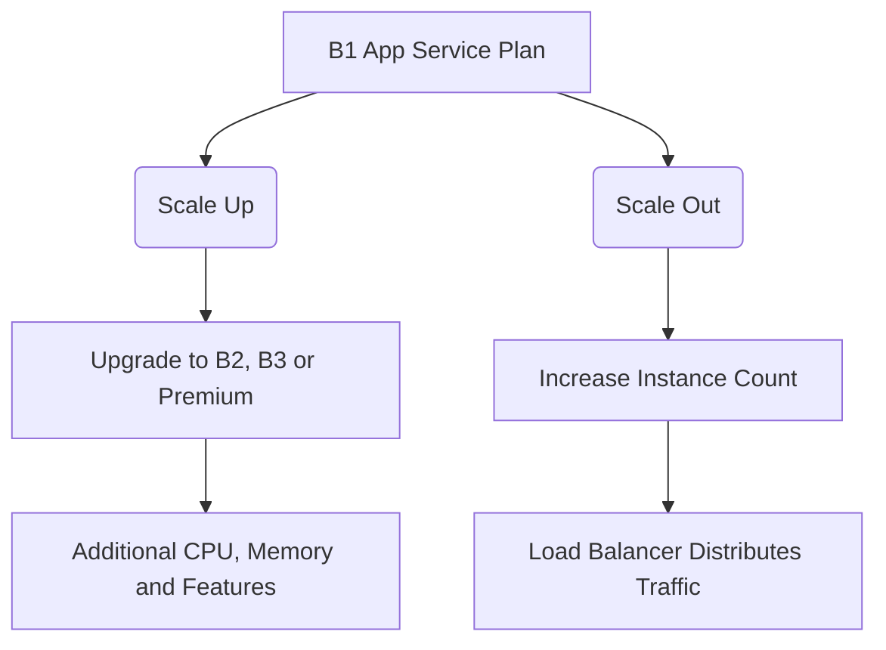

# Azure Node.js Application Deployment and Architecture Overview

This project demonstrates the deployment of a production-grade Node.js Express application on Microsoft Azure App Service (Platform as a Service). The implementation showcases modern cloud deployment practices, automated CI/CD pipelines, secure application configuration management, monitoring capabilities, and scalability planning.

## Application URL

**Live Application:**
http://nzemikez-agg8fjdffgbbendg.westeurope-01.azurewebsites.net

---

# Project Structure

```text
azure-node-app/
├── .github/workflows/       # GitHub Actions workflows for CI/CD automation
├── public/                  # Static resources such as CSS and client-side assets
│   └── style.css            # Application styling
├── views/
│   ├── index.ejs            # Main application template
│   └── 404.ejs              # Custom error page
├── app.js                   # Application entry point and routing logic
├── package.json             # Project dependencies and runtime configuration
├── summary.txt              # Deployment summary document
└── README.md                # Project documentation
```

---

# Architecture Decisions and Design Rationale

The following architectural choices were made to ensure reliability, maintainability, performance, and cost efficiency.

## 1. Azure App Service Plan – Basic (B1)

The Basic B1 App Service Plan was selected because it provides dedicated computing resources and removes many of the limitations associated with the Free tier.

### Benefits of B1

* Dedicated virtual machine resources improve performance consistency.
* Supports the **Always On** feature, reducing application cold-start delays.
* Enables custom domain configuration and SSL certificate support.
* Allows manual horizontal scaling up to three instances.
* Integrates seamlessly with Azure monitoring and diagnostics services.

The B1 plan provides a practical balance between functionality and cost for small-to-medium production workloads.

---

## 2. Deployment Region – West Europe

West Europe was chosen as the deployment region due to its strong infrastructure and proximity to European users.

### Advantages

* Reduced latency for users located within Europe.
* Alignment with European data protection requirements such as GDPR.
* High service availability and robust networking infrastructure.
* Strong regional redundancy and Azure service support.

---

## 3. Runtime Environment – Node.js 22 LTS

Node.js 22 Long-Term Support (LTS) was selected as the application runtime.

### Reasons for Selection

* Long-term security updates and maintenance support.
* Access to modern JavaScript language features.
* Improved runtime performance through enhancements in the V8 engine.
* Greater stability for enterprise and production workloads.

---

## 4. Operating System – Linux

The application is hosted on Azure App Service for Linux.

### Advantages of Linux Hosting

* Lower operating costs compared to Windows hosting.
* Reduced resource overhead.
* Faster startup times and improved container efficiency.
* Excellent compatibility with Node.js and npm ecosystems.

---

# Continuous Deployment Using GitHub Actions

Application deployment is automated using GitHub Actions integrated through Azure Deployment Center.

## Deployment Process

### Step 1: Source Control

Push the application code to a GitHub repository.

### Step 2: Configure Deployment Center

1. Open the Azure Portal.
2. Navigate to the App Service resource.
3. Select **Deployment Center**.
4. Choose **GitHub** as the deployment source.
5. Authenticate GitHub access.
6. Select the repository and target branch (`main`).

### Step 3: Workflow Generation

Azure automatically creates a GitHub Actions workflow and stores it within the repository under:

```text
.github/workflows/
```

### Step 4: Automated Build

Each push to the configured branch triggers the pipeline, which:

* Checks out the repository.
* Detects the runtime environment using Azure Oryx.
* Installs required dependencies.
* Builds the application if necessary.

### Step 5: Deployment

The generated build artifacts are deployed automatically to Azure App Service, minimizing service interruption during updates.

---

# Application Configuration

The application uses environment variables to separate configuration settings from source code.

| Variable | Purpose                            | Production Value |
| -------- | ---------------------------------- | ---------------- |
| APP_ENV  | Defines the deployment environment | production       |
| APP_NAME | Application display name           | Azure Node App   |

## Configuring Environment Variables

1. Open the Azure Portal.
2. Navigate to the App Service resource.
3. Select **Configuration** (or **Environment Variables**).
4. Create a new application setting.
5. Enter the required key and value.
6. Save the changes.

Azure automatically restarts the application to apply the updated configuration.

---

# Monitoring and Diagnostics

Continuous monitoring helps identify performance bottlenecks and operational issues before they impact users.

## Azure Metrics

Metrics can be accessed through:

```text
Azure Portal → App Service → Metrics
```

Commonly monitored metrics include:

* CPU Utilization
* Memory Usage
* Response Time
* HTTP 5xx Errors
* Request Count

These metrics assist in evaluating application health and resource consumption.

---

## Real-Time Log Streaming

### Enable Logging

1. Navigate to **App Service Logs**.
2. Enable **Application Logging (Filesystem)**.
3. Configure retention settings.
4. Save changes.

### View Logs

Open the **Log Stream** blade to monitor live application output, including messages generated through `console.log()`.

---

## Application Insights

Application Insights provides advanced observability features.

### Key Features

* **Application Map** for dependency visualization.
* **Transaction Search** for diagnosing failed requests.
* **Live Metrics** for real-time performance monitoring.
* End-to-end request tracing and diagnostics.

Application Insights helps accelerate troubleshooting and performance analysis.

---

# Scaling Strategy

The Basic B1 plan supports both vertical and horizontal scaling approaches.



## Horizontal Scaling (Scale Out)

Horizontal scaling increases the number of running instances.

### Benefits

* Improved handling of concurrent user traffic.
* Better fault tolerance.
* Load balancing across multiple servers.

The B1 plan supports manual scaling up to three instances.

### Limitation

Automatic scaling policies are unavailable on B1 and require a Standard (S1) plan or higher.

---

## Vertical Scaling (Scale Up)

Vertical scaling upgrades the resources assigned to the application.

### Typical Upgrade Scenarios

* High memory consumption.
* CPU bottlenecks.
* Need for deployment slots.
* Requirement for automated backups.
* Requirement for autoscaling functionality.

Examples include upgrading to B2, B3, or Premium tiers.

---

## Scaling Recommendations

### Scale Out When

* Traffic volume increases significantly.
* CPU utilization remains consistently high.
* Request latency becomes elevated.

### Scale Up When

* Memory exhaustion occurs.
* Resource-intensive workloads are introduced.
* Advanced App Service features are required.

---

## Demonstrating Horizontal Scaling

If subscription resources permit, scaling can be demonstrated as follows:

1. Open the App Service Plan.
2. Navigate to **Scale Out (App Service Plan)**.
3. Select **Manual Scale**.
4. Increase the instance count from 1 to 2 or 3.
5. Save the configuration.
6. Capture a screenshot as deployment evidence.

Suggested screenshot location:

```text
screenshots/scale_out.png
```

---

# Troubleshooting Common Issues

## Application Startup Failures

### Possible Causes

* Runtime exceptions.
* Incorrect port configuration.
* Application crashes during initialization.

### Resolution

* Review Log Stream output.
* Confirm the application listens on `process.env.PORT`.
* Fix any reported runtime errors.

---

## Oryx Build Failures

### Possible Causes

* Missing dependencies.
* Unsupported Node.js version.
* Incorrect package configuration.

### Resolution

* Review Deployment Center logs.
* Verify the presence of a valid `start` script.
* Ensure runtime compatibility between local and Azure environments.

---

## Deployment Updates Not Appearing

### Possible Causes

* Failed GitHub Actions workflow.
* Deployment still processing.
* Incorrect deployment branch configuration.

### Resolution

* Review workflow status under GitHub Actions.
* Verify deployment targets the correct branch.
* Confirm deployment completion within Azure Portal.

---

## Always On Issues

### Symptoms

The application experiences slow response times after periods of inactivity.

### Resolution

1. Navigate to **Configuration → General Settings**.
2. Confirm that **Always On** is enabled.

This feature prevents the application from becoming idle and improves responsiveness.

---

# Running the Application Locally

Follow these steps to test the application before deployment.

### Install Dependencies

```bash
npm install
```

### Start the Application

```bash
npm start
```

### Access the Application

Open your browser and navigate to:

```text
http://localhost:3000
```

The application should now be running locally and ready for testing.
